# QuizApp

QuizApp is a cross-platform quiz application developed using Flutter that runs on Android, iOS, and the web. It allows users to create and take quizzes on various topics. This README provides an overview of the app's features and how to use them.
- [Demo Video is available here...](readme-assets/screenrecorder-2023-09-13-17-48-49-686_0_compressed.mp4)

## Features

1. **Custom App Icon**:
   - Uses `flutter_launcher_icons` to set a custom app icon.
   - 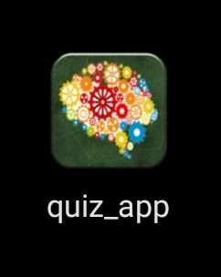

2. **Native Splash Screen**:
   - Utilizes the `flutter_native_splash` package to display a native splash screen on app launch.
   - 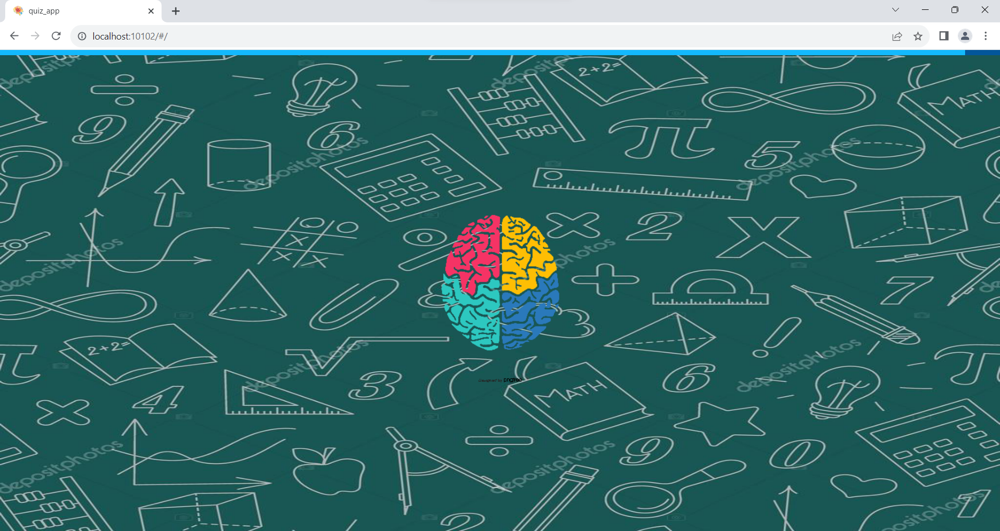

3. **Home Screen**:
   - Contains various features, including:
     - Adding questions to database.
     - Displaying all questions.
     - Filtering questions by categories.
     - Creating quizzes with random questions.
     - Taking quizzes by quiz ID or title.
     - Customizing and creating your own quizzes.
     - 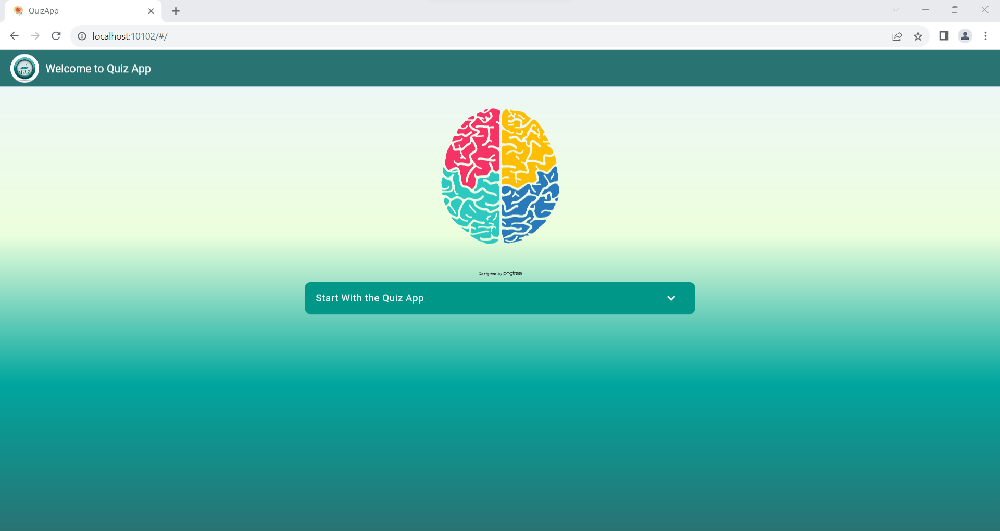
     - 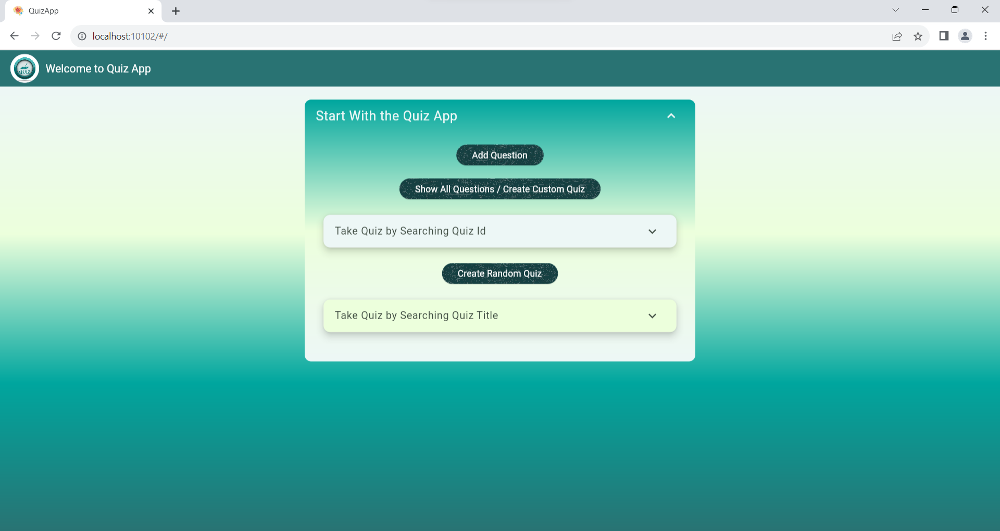
     
4. **Add Question**:
   - Users can:
     - Select a category.
     - Specify the difficulty.
     - Provide a question, options, and answer.
     - Add question to the database.
     - 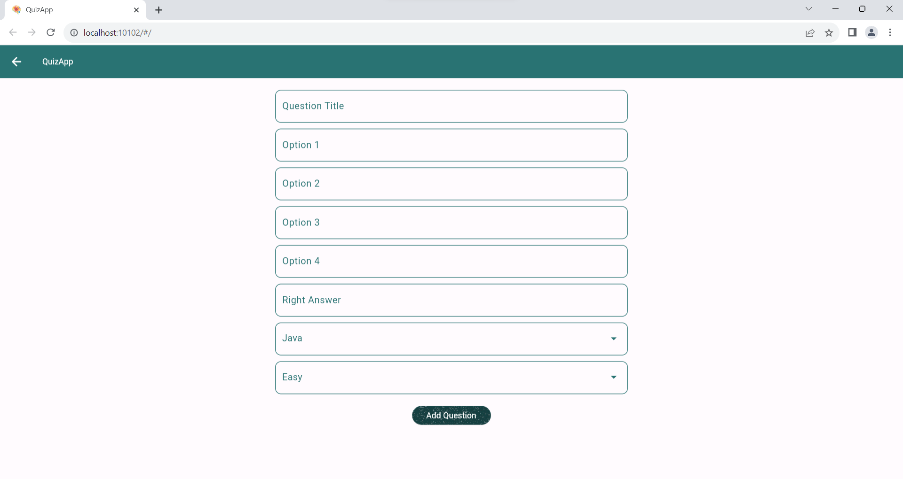

5. **Show All Questions**:
   - Displays all questions.
   - Users can filter questions by category.
   - 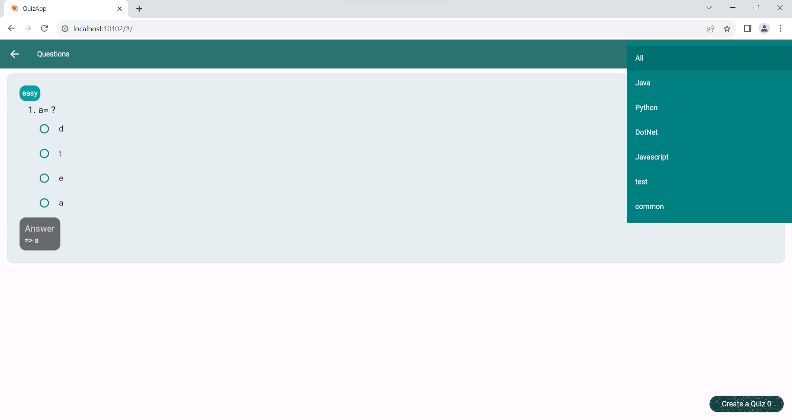

6. **Create Custom Quiz**:
   - Allows users to create custom quizzes by selecting questions options and it will be added to the list.
   - Users can give the quiz a title, and it will be added to the database.
   - 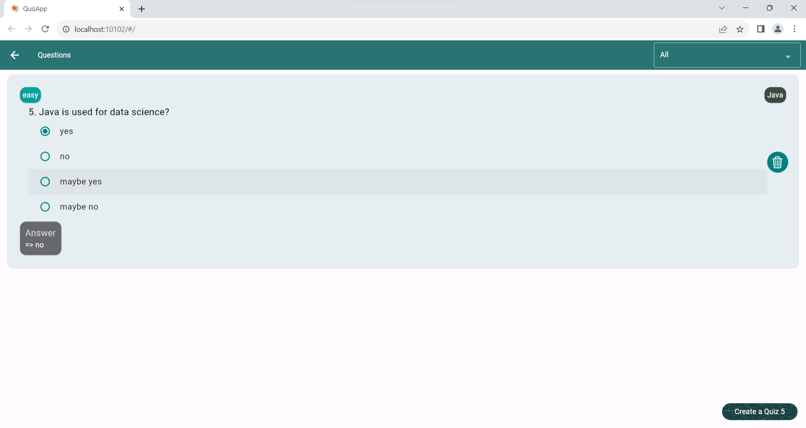
   - 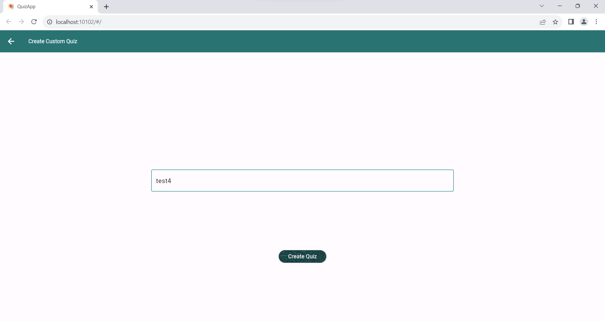

7. **Create Quiz with Random Questions**:
   - Users can select a category, give it a title, and specify the number of questions.
   - Clicking the create button generates the quiz.
   - 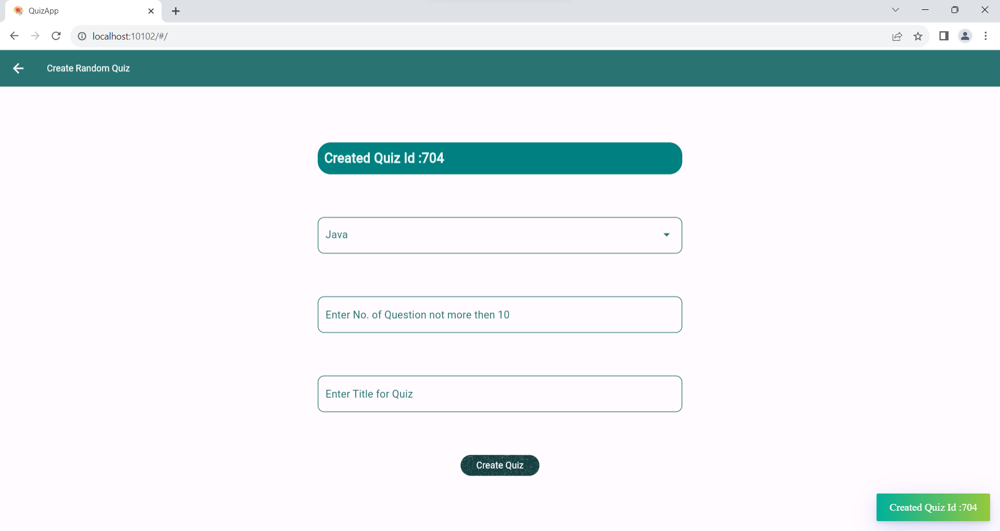

8. **Take Quiz by ID**:
   - Enter a quiz ID to access the quiz.
   - Users select the correct options for questions and submit answers.
   - The score is displayed upon completion.
   - 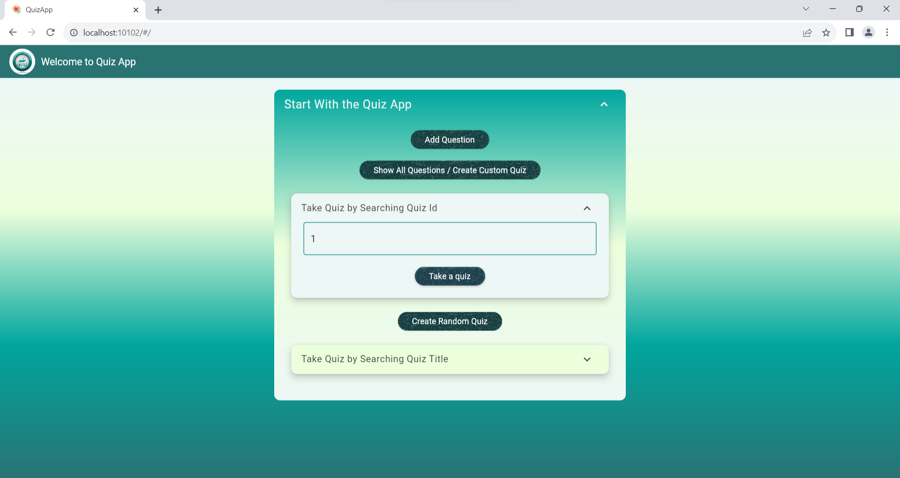
   - 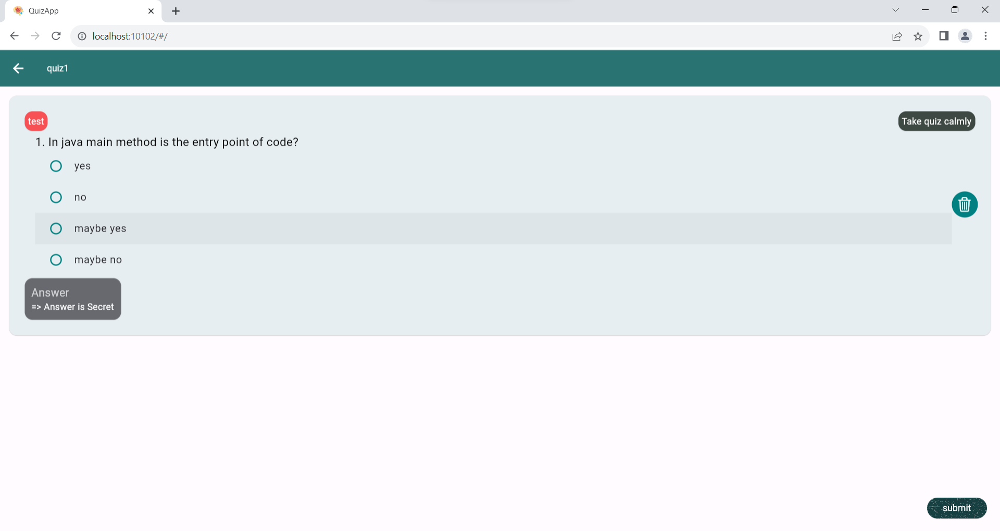
   - 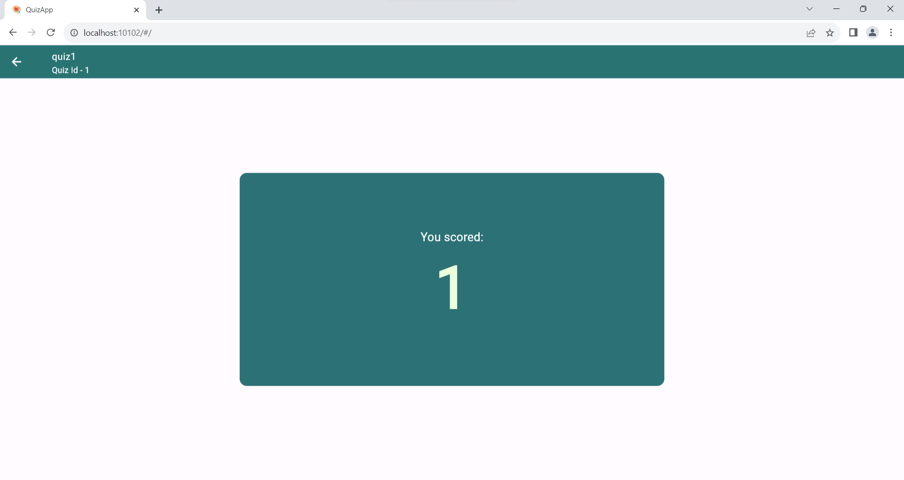

9. **Take Quiz by Title**:
   - Enter a quiz title to access the quiz.
   - Users select the correct options for questions and submit answers.
   - The score is displayed upon completion.
   - 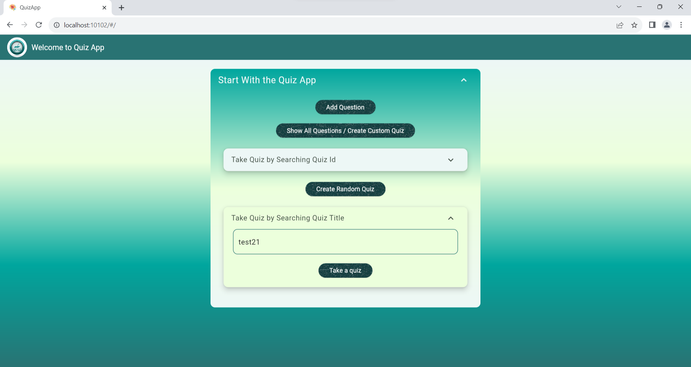
   - 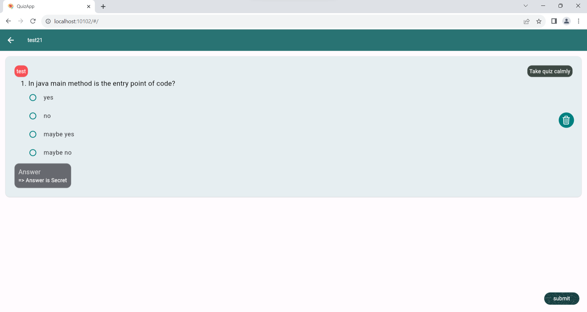
   - Note: If multiple quizzes share the same title, the first created quiz is displayed.

## Rest Api resource
The backend API is developed using Spring Boot and is available in the repository [Quiz App Spring Boot Backend](https://github.com/Ultranmus/Quiz-App-Spring-Boot-Backend).
